### Node launch deep dive:Scheduling
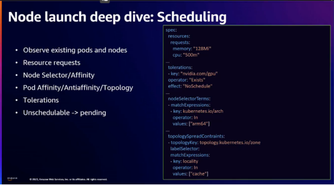

### Batching
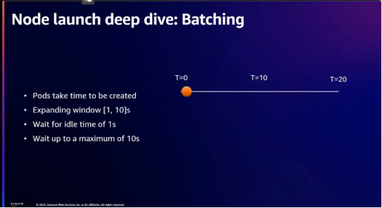

### Binpacking
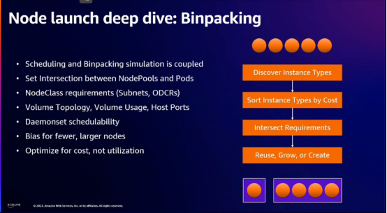
kube-scheduler is using searching for node, but karpenter is not like that because of large space, gerenation is karpenter use

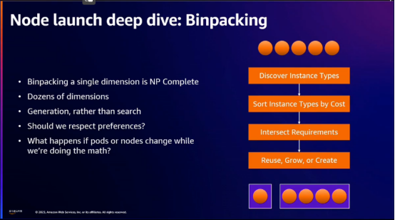
What happen if there is no available capacity in the zone user perfer?
What happen if the pods and nodes changes while we’re doing the math?
the situation is changed when we execute
kube-scheduler is using searching for node, but karpenter is not like that because of large space, gerenation is karpenter use

### Launch decsion
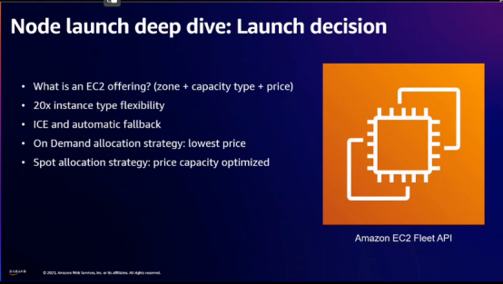
Spot allocation strategy is find out the cheapest instance type but is not about to be disrupted through EC2 Fleet API

### Onboarding Karpenter
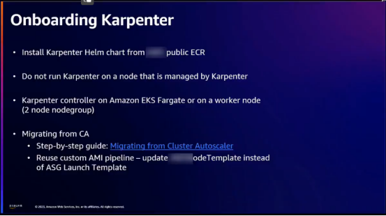
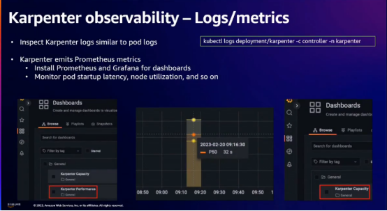
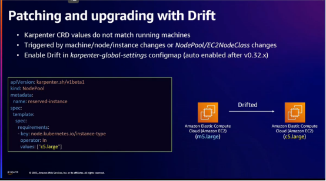
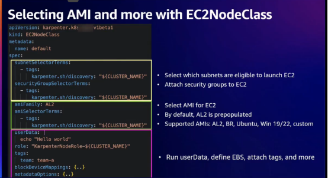
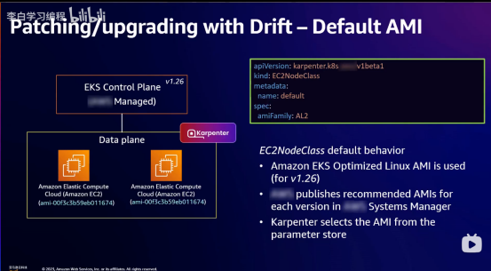
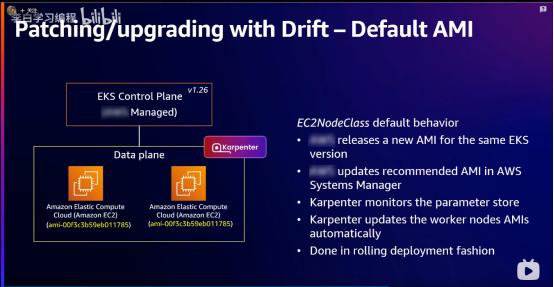
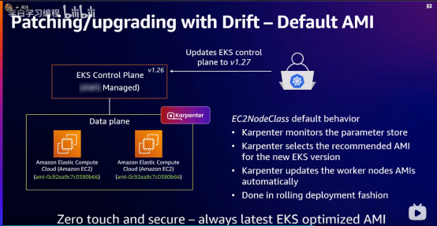
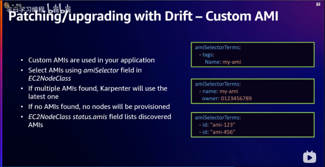
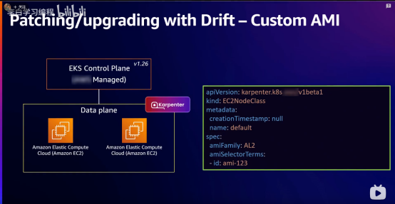
Simply remove the old custsom ami `ami-123`, that point the ami drift
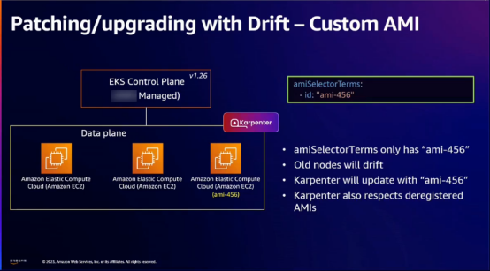
Conslidation is related to bin-packing and choose the cheapest instance for user
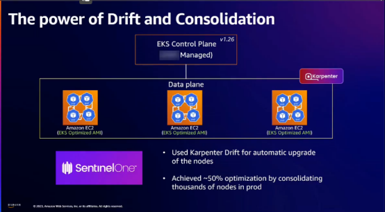

### Node disruption deep dive
Disruption is event happened in cluster cause to remove node
PDB is essential for using Karpenter
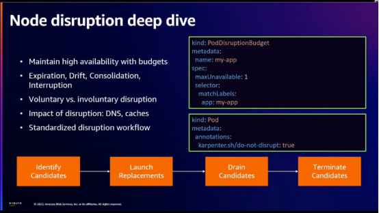
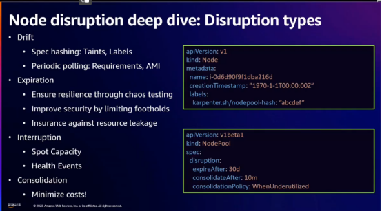

## Reference
[re:Invent 2023 | 利用 Karpenter 的力量扩展、优化和升级 Kubernetes](https://www.bilibili.com/video/BV1cj411L7qh/?spm_id_from=333.337.search-card.all.click&vd_source=2b3537c234d02f82c699d6ee46f94a38)